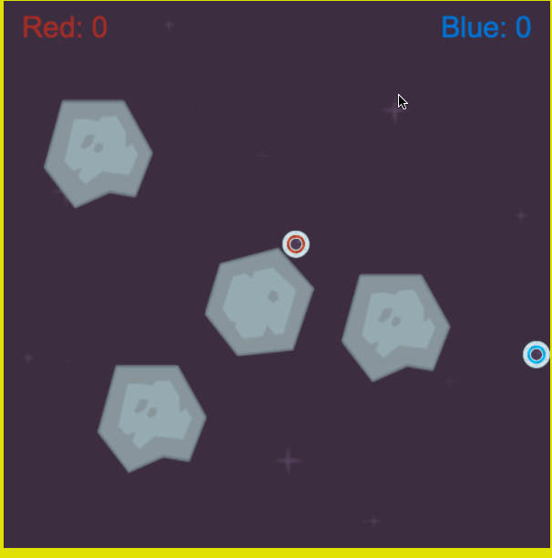

# Star Burst

Link - [Star Burst](https://joeyjira.github.io/Star-Burst/)

Star Burst 

This game uses HTML5, CSS3,Canvas, and Javascript.

## Features & Implementation
### Fly and Bounce

The app uses a minimalistic design approach consisting of a side navigation bar and the main content. The main features of the app are **Hello World**, **Collections**, and **Articles**

### Shoot and Destroy

## Development Design
* [Wireframes][wireframes]
* [React Components][components]
* [API Endpoints][api-endpoints]
* [DB Schema][schema]
* [Sample State][sample-state]

[wireframes]: /docs/wireframes
[components]: /docs/component-hierarchy.md
[sample-state]: /docs/sample-state.md
[api-endpoints]: /docs/api-endpoints.md
[schema]: /docs/schema.md

## In the Future

In the future I would like to revisit the News API I was using and replace it with a more detailed one.

Depending on the API I would be using the search functionality would need to be moved from the front end to the back end.  

An Additional feature I want to add is to have a page showing the top headlines from the difference sources.