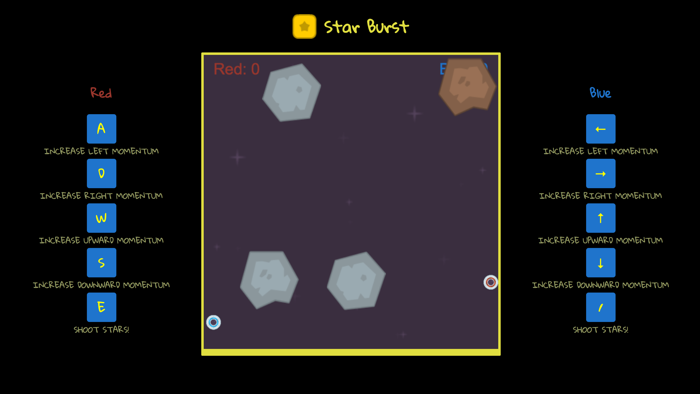
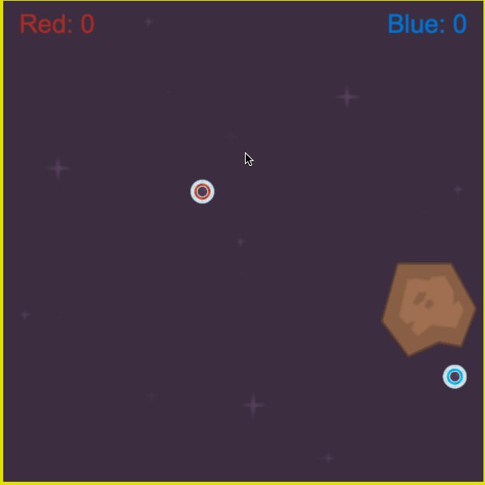

# Star Burst


Link - [Star Burst](https://joeyjira.github.io/Star-Burst/)


Star Burst is javascript game that borrows from mechanics from old school *Atari* and *Nintendo* games

This project was built under a 4 day deadline constraint



## Technology

* Star Burst was built with vanilla JavaScript to handle the overall logic of the game

* HTML5, Canvas and CSS was used to render the game on the page

* Webpack was used to bundle files

## How to Play

The game is all about battling your friend in space while trying to navigate through asteroids. Two players try to shoot each other down and for each hit the player gets a point



## Features & Implementation

The ships and asteroids are treated as moving objects that bounces of each other and the edge of the canvas. The angles of impact are then calculated using inverse tan to yield the most accurate bounce path

``` javascript
// asteroid.js
collideWith(otherObject) {
    if (otherObject instanceof Ship) {
      let angleDeg =
        Math.atan2(
          this.pos[1] - otherObject.pos[1],
          this.pos[0] - otherObject.pos[0]
        ) *
        180 /
        Math.PI;
      angleDeg += 180;

      if (
        angleDeg < 45 ||
        angleDeg > 315 ||
        (angleDeg > 135 && angleDeg < 225)
      ) {
        otherObject.vel = [-otherObject.vel[0], otherObject.vel[1]];
      } else if (
        (angleDeg > 45 && angleDeg < 135) ||
        (angleDeg > 225 && angleDeg < 315)
      ) {
        otherObject.vel = [otherObject.vel[0], -otherObject.vel[1]];
      } else {
        otherObject.vel = [-otherObject.vel[0], -otherObject.vel[1]];
      }
    } else if (otherObject instanceof Bullet) {
      this.remove();
      otherObject.remove();
    } else if (otherObject instanceof Asteroid) {
      let angleDeg =
        Math.atan2(
          this.pos[1] - otherObject.pos[1],
          this.pos[0] - otherObject.pos[0]
        ) *
        180 /
        Math.PI;
      angleDeg += 180;

      if (
        angleDeg < 45 ||
        angleDeg > 315 ||
        (angleDeg > 135 && angleDeg < 225)
      ) {
        otherObject.vel = [-otherObject.vel[0], otherObject.vel[1]];
        this.vel = [-this.vel[0], this.vel[1]];
      } else if (
        (angleDeg > 45 && angleDeg < 135) ||
        (angleDeg > 225 && angleDeg < 315)
      ) {
        otherObject.vel = [otherObject.vel[0], -otherObject.vel[1]];
        this.vel = [this.vel[0], -this.vel[1]];
      } else {
        otherObject.vel = [-otherObject.vel[0], -otherObject.vel[1]];
        this.vel = [-this.vel[0], -this.vel[1]];
      }
    }
  }
```

## Future Features for the Project

- [ ] Add Power-ups to the game
- [ ] Able to select different game modes
- [ ] Able to choose different ships