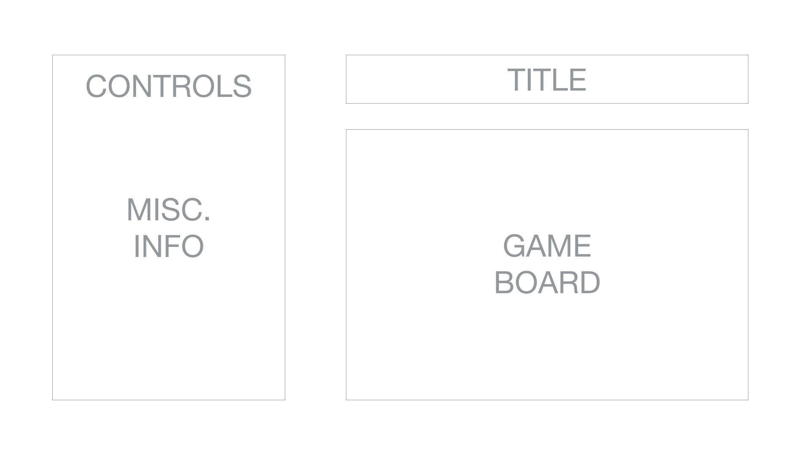
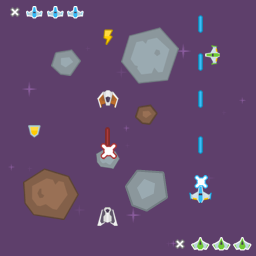

## Star Burst

### Background  

Star Burst is a space shooter where the player pilots a space ship through an asteroid field trying to shoot enemy ships down. Each of the ships will have 3 lives and each hit from a laser takes down the health by 1 point. The controls of the ship will come from user input on the keyboard and the direction the ships face will be from the mouse. The game ends when the user's ship is the last one on the field or the user's health is down to 0.

### Functionality & MVP  

In a game of Star Burst, players will be able to:

- [ ] Fly the ships around on the board using keyboard and mouse controls
- [ ] Ships are able to shoot lasers 
- [ ] Spawn enemy ships and battle it out in space!
- [ ] Spawn meteors to increase difficulty

In addition, this project will include:

- [ ] An About modal describing the rules and the background of the game
- [ ] A production Readme

### Wireframes

Star Burst will have a single screen consisting of a title, information panel, 
and a game board. There will also be buttons at the side of the game to mute the sound
and restart the game.

The picture below is the actual game that will be going into the game board

### Architecture and Technologies

This project will be implemented with the following technologies:
Star Burst will be made with the following technologies:

- Vanilla JavaScript with browser APIs for overall structure and game logic,
- `HTML5 Canvas` for DOM manipulation and rendering,
- Webpack to bundle and serve up the various scripts.

In addition to the webpack entry file, the following scripts will be involved in this project:

`background.js`: this script will handle the rendering of the background image and scrolling it across the screen

`objects.js`: this script will handle the logic for all objects that spawn on the board. The coordinates and velocity of ships and asteroids will be handled by this file.

`ship.js`: this script will inherit from the `object.js` file and also take care of reading user inputs to control the ship.

`meteors.js`: this script will handle spawning obstacles on top of the background to obstruct player and enemy ships.

`game.js`: this script will handle all the rendering and updating of the game and checking when the game is over.

### Implementation Timeline

**Day 1**: Create all the necessary files such as `webpack.config.js` and the scripts mentioned above. Setup `index.html` and `background.js`. Goals for the day:

- Render a background in the browser with canvas
- Make the background pan continuously giving an illusion of infinite space
- Render ships onto the board

**Day 2**: The objective today is to write `ship.js` and get them on top of the background. Then complete the initial logic for the ship to take in keyboard input.  Goals for the day:

- Ships can take in user input and move accordingly
- Ships can shoot lasers
- Spawn enemy ships
- Detect collisions between objects

**Day 3**: The object on this day is to write a smart pattern for AI ships to follow in order for them to sufficiently compete with the user. Goals for the day:

- Enemy ships able to move around on their own
- Enemy ships are able to shoot lasers 

**Day 4**: Style the frontend, making it polished and professional.  Goals for the day:

- Spawn asteroids to increase difficulty
- Make sure the game runs as smoothly as possible

### Bonus features

There are many directions this cellular automata engine could eventually go.  Some anticipated updates are:

- [ ] Add Power-Ups to the game
- [ ] Add a second player to the game
- [ ] Implement different game modes